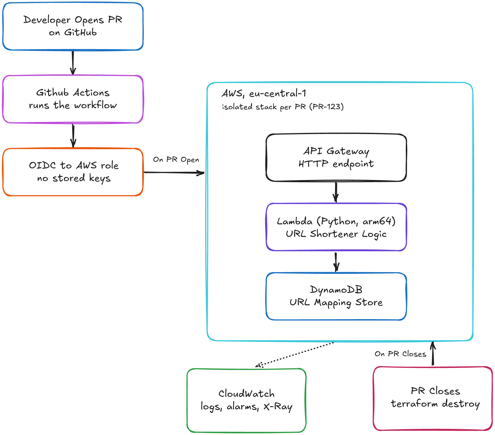

# 🏗️ Ephemeral Environments on AWS


Every pull request in this repository automatically spins up a fresh, isolated AWS environment, runs an integration test against it, posts the live URL as a PR comment, and tears everything down when the PR closes.

I built this to show how automated preview environments cut manual deployment steps, catch integration bugs before merge, and reduce idle infrastructure cost to near zero.

The example app is a small URL shortener. It exists only to give the automation something real to deploy. The automation is what this project is actually demonstrating.

---

## 🗺️ Architectural Design

<p align="center">
  
</p>

A pull request triggers a GitHub Actions workflow that assumes an AWS IAM role via OIDC (no stored credentials), provisions a fresh isolated environment with Terraform, runs an integration test against the deployed URL, and posts that URL as a PR comment. When the PR closes, Terraform destroys the environment and all its resources.

**How a request flows through the system:**

```
  Developer opens a PR on GitHub
        |
        v
  GitHub Actions          triggers the workflow automatically
        |
        v
  OIDC to AWS             assumes an IAM role, no stored credentials
        |
        v
  Terraform apply         provisions a fresh isolated environment for that PR
        |
        +-----------------------------+
        |                             |
        v                             v
  API Gateway                   DynamoDB Table
  (front door, receives          (stores short_id
   HTTP requests)                 to long_url mapping)
        |
        v
  Lambda (handler.py)     runs the URL shortener logic
        |
        v
  Response back to caller (short_id on POST, 301 redirect on GET)
```

The same GitHub Actions workflow handles both events: `apply` on PR open and `destroy` on PR close. I did not draw a separate arrow from GitHub Actions to the teardown box, because routing it across the full canvas makes the diagram harder to read. The behaviour is described here in text instead: one workflow, two triggers, one for creation and one for cleanup.

---

## 🏛️ Stack

| Tool | Role |
|------|------|
| Terraform | Infrastructure as Code for all AWS resources |
| GitHub Actions + OIDC | CI/CD pipeline with no long-lived AWS credentials stored as secrets |
| AWS Lambda (Python, arm64) | URL shortener handler running on Graviton |
| Amazon API Gateway | HTTP endpoint in front of Lambda |
| Amazon DynamoDB | URL mapping store |
| Amazon CloudWatch | Logs, alarms, and dashboard |
| Makefile | Wrapper for the most common commands |

Region: `eu-central-1` (Frankfurt). I chose Frankfurt for EU data residency, which is a real constraint in consulting work and worth being explicit about.

---

## 📋 Phases

| # | Phase | What it covers | Status |
|---|-------|----------------|--------|
| 0 | Setup and safety | AWS account, billing alarm, IAM user, toolchain check | ✅ Done |
| 1 | Manual baseline | 48 steps, 39 minutes by hand | ✅ Done |
| 2 | Infrastructure as Code | Terraform modules, Makefile (3 min to apply) | ✅ Done |
| 3 | CI/CD and ephemeral environments | GitHub Actions, OIDC, PR automation | 🔲 Pending |
| 4 | Observability | CloudWatch alarms, X-Ray tracing, structured JSON logs | 🔲 Pending |
| 5 | One optimization pass | Graviton, right-sized Lambda memory, 1000-request load test | 🔲 Pending |
| 6 | Teaching artifact | Final README, architecture diagram, four measured metrics | 🔲 Pending |

Stretch tracks (after the core is done): an AWS-native variant with CodePipeline and CloudFormation, a Docker and EKS setup with Prometheus for a serverless versus Kubernetes comparison, and a small Go CLI tool called `envctl` that lists and destroys orphaned environments.

---

## 📊 Honest metrics

All numbers in this project come from measurements I took myself. When a result depends on a run I have not yet completed, I write a placeholder like `[MEASURED: fill in after running]` rather than inventing a figure. No placeholder survives into the final README.

The four metrics I am working toward:

1. Provisioning time: manual steps and minutes versus the automated pipeline
2. Idle cost: per-environment spend reduced to near zero via auto-teardown
3. Time to root cause: seeded failure found via X-Ray tracing versus raw log reading
4. Performance: p99 latency and cost change from the Graviton and memory right-sizing pass

---

## 📁 Repository layout

```
.
├── app/           # Python Lambda handler
├── infra/         # Terraform modules
├── .github/       # GitHub Actions workflows
├── images/        # Architecture diagrams
├── cli/           # Go CLI tool (envctl), added in the final stretch
├── aws-native/    # Stretch A: CodePipeline and CloudFormation
├── docs/          # Build playbook and runbooks (local only, not in repo)
└── Makefile
```

This layout fills in progressively as each phase completes. Folders that do not exist yet are listed here so the structure is visible from the start.

---

## 🔒 Security approach

This pipeline uses GitHub OIDC to assume an AWS IAM role at runtime. There are no long-lived AWS credentials stored as GitHub secrets. The IAM role is scoped to the minimum permissions each phase actually needs.

---

## 🚫 Tools I considered and chose not to use

- **Travis CI**: a solid hosted CI service, but GitHub Actions is already where the code lives and has native OIDC support for AWS, so adding Travis would mean a second platform for no gain.
- **Jenkins**: self-managed and powerful, but running a Jenkins server adds operational overhead that works against the point of this project, which is showing how to reduce operational toil.
- **Chef**: a mature configuration management tool, but this project has no long-lived servers to configure. Terraform handles the infrastructure and Lambda handles the compute, so Chef has nothing to manage here.

---

## 🤖 How I built this

I built this project with AI assistance (Claude Code), the same way most engineers work today. I use these tools to move quickly through boilerplate and mechanics, so I can spend my attention on the parts that matter: the design decisions, the trade-offs, and the problem solving. Automated LLM tooling was restricted strictly to syntax verification and documentation linting. I drove every decision, measured every result myself, and I can explain every line.

---

## 🤝 Contributing

This is an open portfolio project. Feedback, suggestions, and pull requests are welcome.

If something in the setup does not work, open an issue and describe what step failed and what error appeared. If you want to improve the Terraform, the workflow, or the documentation, open a pull request against `main`. See [CONTRIBUTING.md](CONTRIBUTING.md) for details.
