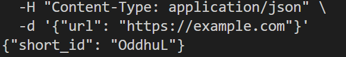
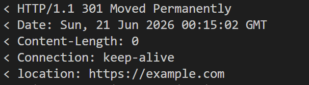
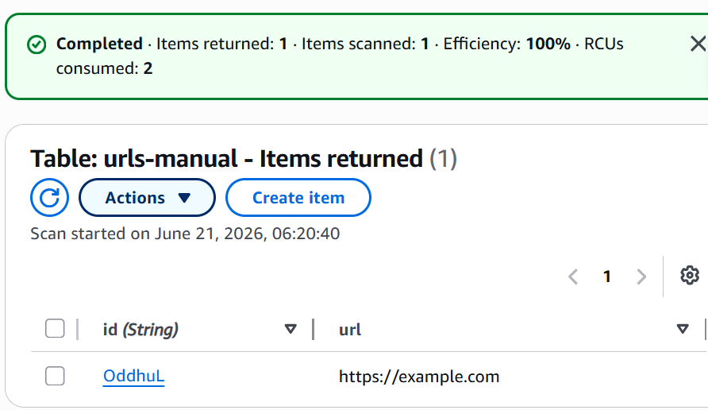

# 📋 Manual Baseline Runbook

Deploying the URL shortener by hand before any automation exists.
Every step is counted and timed. The result is the honest **before** number.

---

## 🏗️ What I am building and in what order

```
  1️⃣  DynamoDB Table
      stores: short_id to long_url
      (no dependencies, created first)
           |
           | Lambda reads and writes here
           |
  2️⃣  Lambda Function
      runs: handler.py
      (needs the table name as an environment variable)
           |
           | API Gateway forwards requests here
           |
  3️⃣  API Gateway
      receives: HTTP requests from the internet
      (created last, depends on Lambda)
```

**Request flow once all three are live:**

```
  Browser or curl
        |
        v
  🌐 API Gateway       receives the HTTP request
        |
        v
  ⚡ Lambda            runs the Python code
        |
        v
  🗄️ DynamoDB          reads or writes the URL mapping
        |
        v
  Browser or curl      gets the short_id or follows the 301 redirect
```

---

## ⏱️ Before I start

- ✅ Start a stopwatch at Step 1
- ✅ Count every numbered step, including redos
- ✅ Region: **eu-central-1 (Frankfurt)** for everything
- ✅ Record mistakes in the Mistakes section below

---

## 🚀 Part 1: Deploy

### 🗄️ A. Create the DynamoDB table

1. Open the AWS Console, navigate to **DynamoDB**
2. Click **Create table**
3. Table name: `urls-manual`
4. Partition key: `id`, type **String**
5. Leave all defaults (on-demand capacity is fine)
6. Click **Create table**, wait for status **Active**

---

### ⚡ B. Prepare the Lambda handler

7. Copy `app/handler.py` from the repository to the Desktop
8. Zip it in the terminal:

```bash
cd ~/Desktop
zip handler.zip handler.py
```

---

### ⚙️ C. Create the Lambda function

9. Navigate to **Lambda** in the AWS Console
10. Click **Create function**, choose **Author from scratch**
11. Function name: `url-shortener-manual`
12. Runtime: **Python 3.11**
13. Architecture: **arm64**
14. Click **Create function**
15. Scroll to **Code source**, click **Upload from** > **.zip file**, upload `handler.zip`
16. Click **Save**
17. Go to **Runtime settings** > **Edit**, confirm handler is `handler.lambda_handler`, save

---

### 🔗 D. Add the DynamoDB environment variable

18. Click **Configuration** tab > **Environment variables** > **Edit**
19. Click **Add environment variable**
    - Key: `TABLE_NAME`
    - Value: `urls-manual`
20. Click **Save**

---

### 🔒 E. Grant Lambda permission to access DynamoDB

21. Click **Configuration** > **Permissions**
22. Click the role name link (opens IAM in a new tab)
23. Click **Add permissions** > **Attach policies**
24. Search for `AmazonDynamoDBFullAccess`, check the box
25. Click **Add permissions**

> In production I would write a least-privilege policy. The managed policy
> is acceptable here because the environment is destroyed at the end.

---

### 🌐 F. Create the API Gateway

26. Navigate to **API Gateway** in the AWS Console
27. Click **Create API**, then under **HTTP API** click **Build**
28. Click **Add integration** > **Lambda**, select `url-shortener-manual`
29. API name: `url-shortener-manual-api`, click **Next**
30. On **Configure routes**, change the default route:
    - Method: `POST`, path: `/shorten`, target: `url-shortener-manual`
31. Click **Add route**, add a second route:
    - Method: `GET`, path: `/{id}`, target: `url-shortener-manual`
32. Click **Next** twice, then **Create**
33. Click **Deploy**
34. Go to **Stages** > **$default**, copy the **Invoke URL**

```
https://xxxxxxxxxx.execute-api.eu-central-1.amazonaws.com
```

---

### ✅ G. Test the deployment

35. Run the POST test, replacing `YOUR_API_URL` with the invoke URL from Step 34:

```bash
curl -X POST https://YOUR_API_URL/shorten \
  -H "Content-Type: application/json" \
  -d '{"url": "https://example.com"}'
```

Expected: `{"short_id": "xxxxxx"}`

36. Run the GET test, replacing `SHORT_ID` with the value returned above:

```bash
curl -v https://YOUR_API_URL/SHORT_ID
```

Expected: `HTTP/1.1 301 Moved Permanently` with `location: https://example.com`

**⏹️ Stop the stopwatch. Record deployment time below.**

---

## 🧹 Part 2: Teardown

Restart the stopwatch.

37. **API Gateway**: select `url-shortener-manual-api`, click **Delete**, confirm
38. **Lambda**: select `url-shortener-manual`, click **Actions** > **Delete**, confirm
39. **DynamoDB**: select `urls-manual`, click **Delete**, type the table name to confirm
40. **IAM**: go to **Roles**, find `url-shortener-manual-role-*`, delete it
41. **CloudWatch**: go to **Log groups**, find `/aws/lambda/url-shortener-manual`, delete it

**⏹️ Stop the stopwatch. Record teardown time below.**

---

## 📊 Results

> Measured on 21 June 2026.

| Metric | Value |
|--------|-------|
| Deployment steps (1 to 36) | 36 steps |
| Deployment time | 35 minutes 5 seconds |
| Teardown steps (37 to 41) | 5 steps |
| Teardown time | 3 minutes 56 seconds |
| Total steps | 41 steps |
| Total time | 39 minutes 1 second |
| Errors requiring a redo | 0 |

### 📸 Proof

**POST /shorten**



**GET /{id} redirect**



**DynamoDB item stored**



---

## 📝 Navigation notes

No steps required a redo. Locating **Configuration** and **Permissions**
inside the Lambda console took 3 to 4 minutes on first use. Terraform
eliminates this entirely: permissions are declared in code with no
console navigation required.

---

## 🎯 What this baseline proves

| | Manual | Automated (Phase 2) |
|-|--------|---------------------|
| Steps | 41 | 1 command |
| Time | 39 minutes | [MEASURED after Phase 2] |
| Errors | 0 (navigation friction exists) | 0 |

The comparison between these two columns is the first honest metric in this project.
