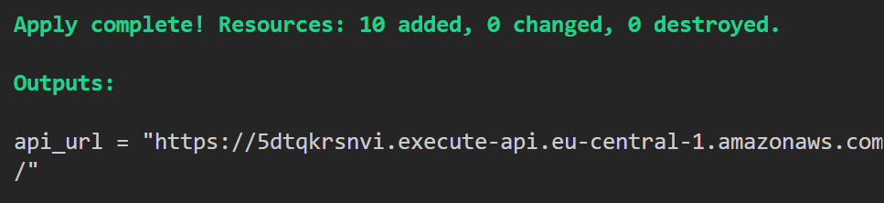
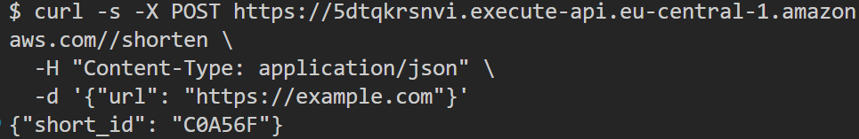
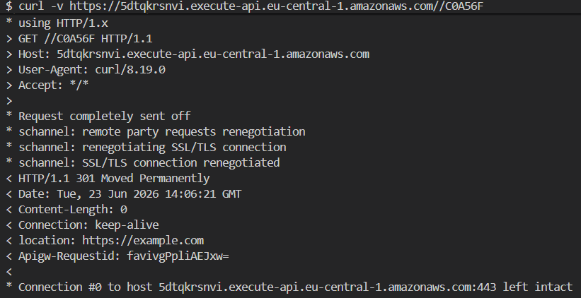
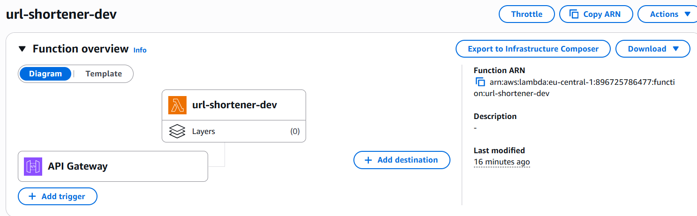
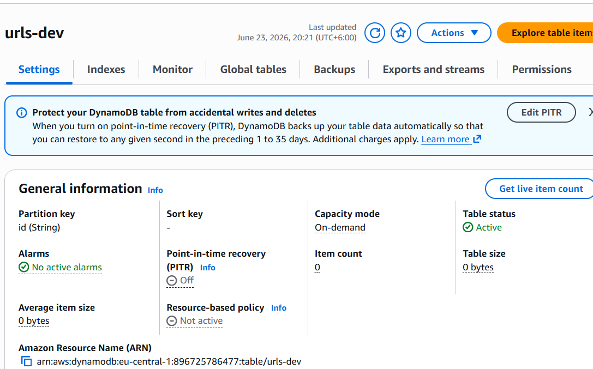
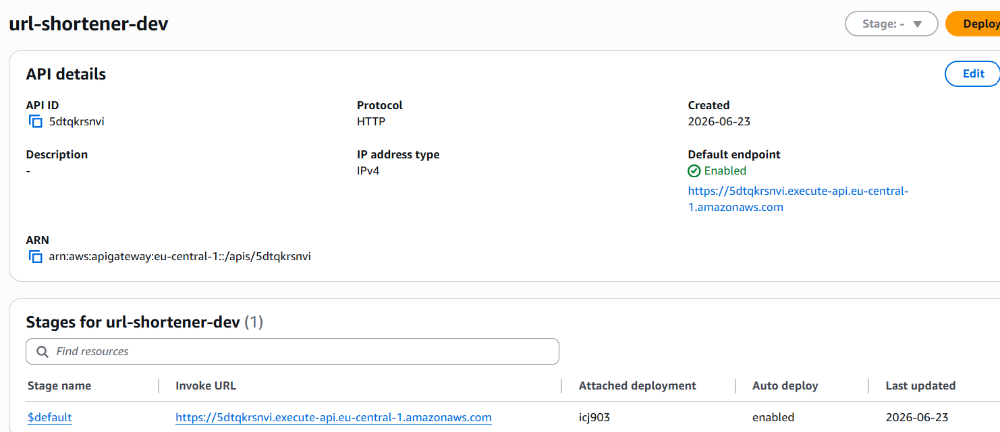

# 🤖 Phase 2: Infrastructure as Code

What I automated, what I learned, and how Terraform replaced 41 manual steps.

---

## 📸 Proof: one command, full deployment

### `terraform apply` output



Terraform created DynamoDB, IAM, Lambda, and API Gateway in sequence.
The `api_url` printed at the end is the live Invoke URL for this environment.

---

### POST /shorten



I ran one `curl` command and received a `short_id` back. Lambda stored the mapping in DynamoDB.

---

### GET /{id} redirect



The `-v` flag shows the `301` status and `location: https://example.com` header. The redirect works.

---

## ☁️ AWS console: what Terraform built

### Lambda



Terraform created `url-shortener-dev` with Python 3.11 on arm64 (Graviton).

---

### DynamoDB



Terraform created the `urls-dev` table with PAY_PER_REQUEST billing. Zero cost at idle.

---

### API Gateway



Terraform created the HTTP API with both routes and the live Invoke URL.

---

## 📊 Before and after

| Metric | Phase 1 (manual) | Phase 2 (Terraform) |
|--------|-----------------|---------------------|
| Steps | 41 | 1 command |
| Time | 39 min 1 sec | Under 3 minutes |
| Repeatable | No, click-by-click | Yes, identical every run |
| Isolated per PR | No | Yes, `env_name=pr-123` |

---

## 🗂️ What I wrote and why

Seven `.tf` files and one `Makefile`. Each has one job.

| File | What it does |
|------|-------------|
| `main.tf` | Declares Terraform version and the two providers (AWS + archive) |
| `variables.tf` | Defines `env_name` and `aws_region` so no value is hardcoded |
| `dynamodb.tf` | Creates the `urls-${env_name}` table |
| `iam.tf` | Creates the IAM role with least-privilege permissions |
| `lambda.tf` | Auto-zips `handler.py` and deploys the function |
| `api_gateway.tf` | Creates the HTTP API, two routes, and Lambda invoke permission |
| `outputs.tf` | Prints the live `api_url` after every apply |

---

## 🔑 Key concepts

### Providers

Terraform cannot talk to AWS on its own. It needs a **provider**, which acts like a device driver.

- `hashicorp/aws` - the AWS driver, knows how to create every AWS resource
- `hashicorp/archive` - a helper that zips files automatically so I never zip by hand

---

### Variables and isolation

```hcl
variable "env_name" {
  default = "dev"
}
```

I pass `env_name=pr-123` at deploy time. Every resource gets that value in its name:

```
urls-pr-123         (DynamoDB)
url-shortener-pr-123  (Lambda)
url-shortener-pr-123  (API Gateway)
```

Three separate PRs produce three completely isolated stacks. They never share data.

---

### archive_file: auto-zip

In Phase 1 I zipped `handler.py` by hand before every upload. Here:

```hcl
data "archive_file" "lambda_zip" {
  type        = "zip"
  source_file = "../app/handler.py"
  output_path = "../app/handler.zip"
}
```

Terraform zips it automatically on every apply, and only re-deploys Lambda when the file content actually changes.

---

### IAM: least-privilege vs Phase 1

| Phase 1 | Phase 2 |
|---------|---------|
| `AmazonDynamoDBFullAccess` | `dynamodb:GetItem` + `dynamodb:PutItem` only |
| Allows everything on all tables | Allows only what `handler.py` actually calls, on this table only |

Two actions. One table. Nothing else.

---

### Outputs

```hcl
output "api_url" {
  value = aws_apigatewayv2_stage.default.invoke_url
}
```

Terraform prints this value at the end of every apply. In Phase 3, the GitHub Actions workflow reads this output and posts it as a PR comment automatically.

---

## 💡 What `env_name` makes possible

This one variable is the foundation of the whole project.

- `make deploy ENV=dev` - my local environment
- `make deploy ENV=pr-123` - isolated stack for PR 123
- `make destroy ENV=pr-123` - teardown only that PR's resources

Every PR gets its own DynamoDB table, Lambda function, and API Gateway URL. Nothing is shared.
