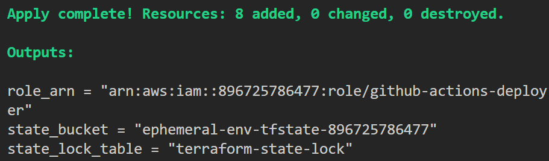
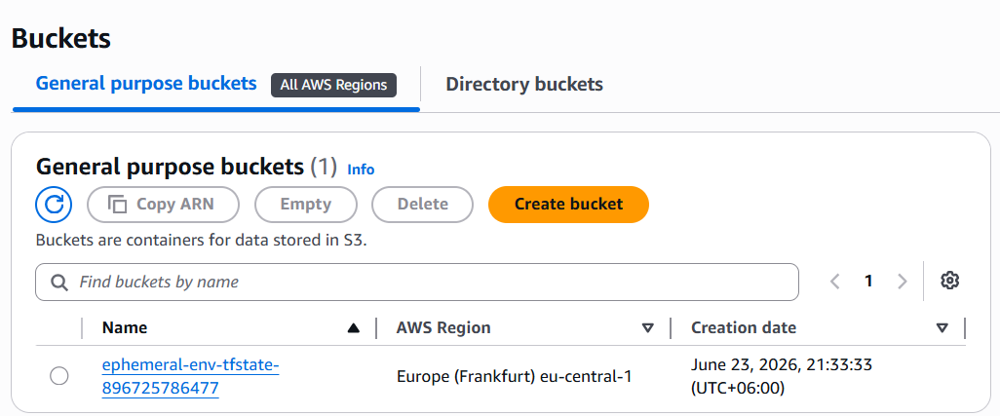
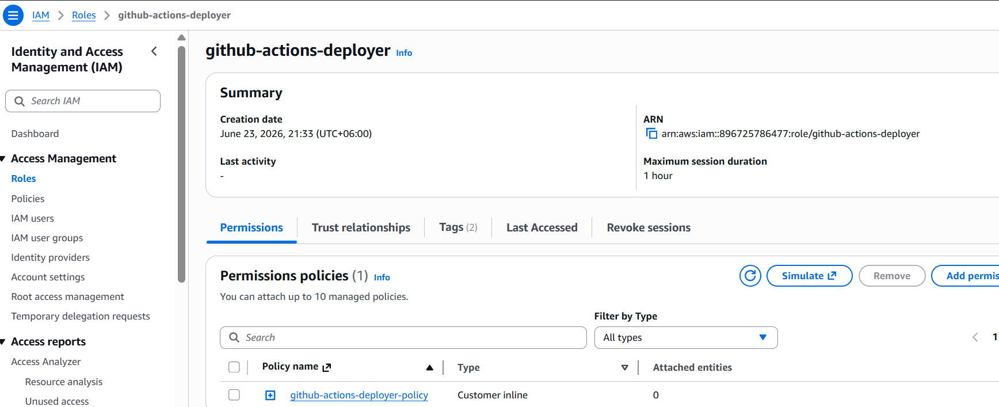
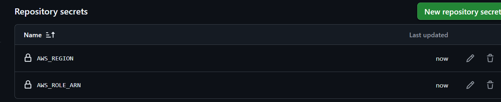

# ⚙️ Phase 3: CI/CD and Ephemeral Environments

What I built, what I learned, and how opening a pull request now provisions a full AWS stack automatically.

---

## 🗺️ What Phase 3 adds on top of Phase 2

Phase 2 gave me one command to deploy. Phase 3 removes that command entirely.

```
Phase 2:   I run   →  make deploy ENV=pr-123
Phase 3:   I open a PR  →  everything happens automatically
```

Three things make this work:

- **Remote state** stored in S3 so two workflow runs share the same Terraform knowledge
- **OIDC trust** so GitHub proves its identity to AWS with no stored password
- **Two workflows** that fire on PR open and PR close

---

## 📸 Proof: bootstrap setup

### Terraform bootstrap apply



One apply creates the S3 bucket, DynamoDB lock table, OIDC provider, and IAM role. I run this once. It never gets destroyed.

---

### S3 state bucket



Terraform state for every PR environment lives here. Both workflows read and write the same file, so `pr-destroy` knows exactly what `pr-deploy` created.

---

### IAM deployer role



The `github-actions-deployer` role is what GitHub Actions assumes at runtime. It has no password. AWS issues a 15-minute session token in exchange for a signed OIDC proof from GitHub.

---

### GitHub secrets



Only one secret is stored: the role ARN. No `AWS_ACCESS_KEY_ID`. No `AWS_SECRET_ACCESS_KEY`. The region is hardcoded in the workflow because it is not sensitive.

---

## 🔑 Key concepts

### Why remote state is required

Terraform writes a state file after every apply. It records which resources exist and their IDs. Without it, destroy would not know what to delete.

In Phase 2 that file lived on my laptop. In GitHub Actions, every workflow run is a fresh machine. The file would vanish after deploy, and destroy would fail.

```
pr-deploy runs  →  terraform apply  →  writes state to S3
pr-destroy runs →  reads state from S3  →  terraform destroy  →  deletes exact same resources
```

I also added a DynamoDB lock table. If two PRs are opened at the same time, one waits for the other to finish writing state before it starts. This prevents corruption.

---

### How OIDC replaces stored credentials

Old approach (what most people do):

```
Store AWS_ACCESS_KEY_ID and AWS_SECRET_ACCESS_KEY in GitHub Secrets
→ These never expire
→ If GitHub leaks them, the AWS account is exposed
```

OIDC approach (what I built):

```
GitHub mints a signed token that says: "I am workflow X in repo rubak714/ephemeral-environments-on-aws, running right now"
→ AWS checks the signature against the OIDC provider
→ AWS returns a 15-minute temporary session
→ Token expires. Nothing to leak.
```

The trust policy also scopes the role to my repo only. Any other GitHub repo that tries to assume it gets denied.

---

### The two workflows

**pr-deploy.yml** fires on `pull_request: [opened, synchronize]`

```
1. Checkout code
2. Install Terraform 1.9.0
3. Assume AWS role via OIDC
4. terraform init  (connects to S3 backend)
5. terraform apply -var="env_name=pr-<number>"
6. Read api_url output, strip trailing slash
7. POST /shorten to create a real test short URL
8. Post PR comment with the live URL and working curl command
```

**pr-destroy.yml** fires on `pull_request: [closed]`

```
1. Checkout code
2. Install Terraform 1.9.0
3. Assume AWS role via OIDC
4. terraform init
5. terraform destroy -var="env_name=pr-<number>"
```

Both workflows use `github.event.pull_request.number` as the env_name. PR 6 gets `pr-6`. Every resource in that stack has `pr-6` in its name. Destroy targets exactly those resources and nothing else.

---

## 🐛 Real errors I fixed during Phase 3

| Error | Cause | Fix |
|-------|-------|-----|
| `Input required: aws-region` | I used `vars.AWS_REGION` but the value was added as a Secret, not a Variable | Switched to `secrets.AWS_ROLE_ARN` and hardcoded the region |
| `AccessDeniedException: lambda:TagResource` | IAM policy was missing three Lambda permissions | Added `lambda:TagResource`, `lambda:ListTags`, `lambda:GetFunctionCodeSigningConfig` to the policy and re-applied bootstrap |
| `//shorten` double slash in PR comment | `api_url` output ends with `/`, comment template added another `/` | Stripped trailing slash with `sed 's\|/$\|\|'` before saving to `GITHUB_ENV` |
| `<short_id>` placeholder in comment | Comment was static, short_id is generated at runtime | Made the workflow run a real POST during deploy and inject the actual short_id |

---

## 📊 Phase 3 measured result

| Metric | Value |
|--------|-------|
| Stored AWS credentials in GitHub | 0 |
| Manual steps to deploy a PR environment | 0 |
| Time from PR open to live URL in comment | Under 4 minutes |
| Environments left running after PR close | 0 (destroyed automatically) |

This is the number that matters for the portfolio: opening a pull request is the only human action required for a full isolated AWS environment to appear and then disappear.
